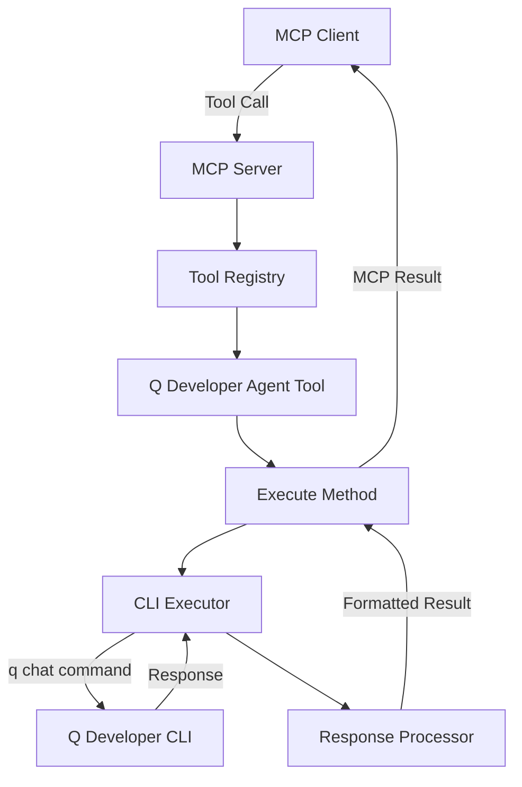

# Q Developer Agent Tool - Design Document

## Overview

The Q Developer Agent tool integrates AWS Q Developer CLI with the MCP (Model Context Protocol) server, enabling AI agents to leverage Q Developer's capabilities for code analysis, generation, and assistance. This design follows established patterns from existing agent tools (Gemini and Claude) while accommodating Q Developer's specific features and constraints.

### Key Design Principles
- **Consistency**: Follow existing agent tool patterns for familiarity
- **Security**: Require explicit enablement and respect file system permissions  
- **Simplicity**: Direct CLI invocation without complex state management
- **Reliability**: Graceful error handling and timeout management
- **Flexibility**: Support various Q Developer configuration options

## Architecture

### Component Structure



### Package Structure
```
internal/tools/qdeveloperagent/
└── qdeveloper.go      # Main tool implementation

tests/tools/
└── qdeveloper_test.go  # Unit tests
```

### Integration Points
1. **Registry Integration**: Auto-registers via `init()` function
2. **MCP Protocol**: Implements standard `tools.Tool` interface
3. **CLI Integration**: Direct execution of `q chat` command
4. **Environment Variables**: Configuration via standard env vars

## Components and Interfaces

### 1. QDeveloperTool Struct
```go
type QDeveloperTool struct{}
```
Stateless implementation following the singleton pattern used by other agent tools.

### 2. Tool Interface Implementation

#### Definition() Method
Returns MCP tool definition with:
- **Name**: `q-developer-agent`
- **Description**: Clear explanation of capabilities
- **Parameters**:
  - `prompt` (required): Instruction for Q Developer
  - `resume` (optional): Continue previous conversation
  - `agent` (optional): Context profile selection
  - `override-model` (optional): Model selection
  - `yolo-mode` (optional): Trust all tools flag
  - `trust-tools` (optional): Specific trusted tools
  - `verbose` (optional): Detailed logging

#### Execute() Method
Core execution logic:
1. Validate enablement status
2. Parse and validate arguments
3. Build command arguments
4. Execute Q Developer CLI
5. Process and return response

### 3. Helper Methods

#### runQDeveloper()
Handles CLI execution with:
- Context-based timeout management
- Command argument construction
- Process execution and output capture
- Error handling and stderr capture

#### ApplyResponseSizeLimit()
Manages response size:
- Configurable size limits via environment variable
- Intelligent truncation at line boundaries
- Informative truncation messages

#### GetMaxResponseSize()
Returns configured maximum response size from environment or default.

## Data Models

### Input Parameters
```go
type QDeveloperArguments struct {
    Prompt       string   // Required instruction
    Resume       bool     // Continue previous conversation
    Agent        string   // Context profile
    OverrideModel string  // Model selection
    YoloMode     bool     // Trust all tools
    TrustTools   string   // Specific trusted tools
    Verbose      bool     // Detailed logging
}
```

### Configuration
```go
const (
    DefaultTimeout         = 180 // seconds
    DefaultMaxResponseSize = 2 * 1024 * 1024 // 2MB
    // Note: Model defaults to Q Developer's current default
    // Available models as per decision log:
    // - claude-3.5-sonnet
    // - claude-3.7-sonnet  
    // - claude-sonnet-4 (default)
)
```

### Environment Variables
- `ENABLE_ADDITIONAL_TOOLS`: Must include "q-developer-agent"
- `AGENT_TIMEOUT`: Operation timeout in seconds
- `AGENT_MAX_RESPONSE_SIZE`: Maximum response size in bytes

## Error Handling

### Error Categories

1. **Enablement Errors**
   - Tool not enabled in environment
   - Clear message directing user to enable

2. **Validation Errors**
   - Missing required prompt
   - Invalid parameter types
   - Empty prompt validation

3. **Execution Errors**
   - CLI not found (command not installed)
     - Return clear message: "Q Developer CLI not found. Please install with: [installation instructions]"
   - CLI execution failure with non-zero exit codes
   - Stderr capture and inclusion in error messages
   - Authentication failures
     - Detect "not authenticated" patterns in stderr
     - Return helpful message about AWS credential configuration

4. **Timeout Errors**
   - Context cancellation on timeout
   - Partial output preservation if available
   - Timeout notification appended to partial response
   - Different timeout considerations for different operations (via AGENT_TIMEOUT env var)

5. **Size Limit Errors**
   - Response truncation with notification
   - Original and truncated size reporting
   - Truncation at line boundaries for readability

6. **Edge Cases**
   - Malformed output handling (return raw output with warning)
   - Concurrent execution in same directory (rely on Q Developer's file locking)
   - Directory permissions for `.q` session storage
     - Detect permission errors and provide actionable message
   - @ syntax in prompts
     - Pre-execution check and warning: "Q Developer does not support @ syntax for file references"
   - Network connectivity issues
     - Let Q Developer handle and report AWS service connection errors

### Error Response Format
```go
// Direct error return for critical failures
return nil, fmt.Errorf("error message: %w", err)

// Informative messages for non-critical issues
output += "\n\n[NOTIFICATION: Issue description and resolution]"
```

## Testing Strategy

### Unit Tests
Located in `tests/tools/qdeveloper_test.go`:

1. **Initialization Tests**
   - Tool registration verification
   - Definition validation
   - Parameter schema checks

2. **Execution Tests**
   - Mock CLI execution
   - Parameter passing validation
   - Error handling scenarios

3. **Response Processing Tests**
   - Size limit application
   - Truncation boundary detection
   - Message formatting

### Test Utilities
Leverage testing patterns similar to existing agent tests:
- Mock CLI execution by creating test implementations of exec.CommandContext
- Use environment variable manipulation for configuration testing
- Standard Go testing patterns with table-driven tests
- Note: Existing agent tests use direct mocking rather than a shared MockExecutor framework

## Implementation Considerations

### Security
1. **Explicit Enablement**: Tool disabled by default, requires ENABLE_ADDITIONAL_TOOLS=q-developer-agent
2. **No Authentication Handling**: User responsibility for AWS credentials
3. **File System Permissions**: Respected by Q Developer
4. **Command Injection Prevention**: 
   - Uses `exec.CommandContext` with separate arguments array (no shell interpretation)
   - User input passed as discrete arguments, never concatenated into command strings
   - Pattern: `exec.CommandContext(ctx, "q", "chat", "--no-interactive", prompt)`
   - No shell metacharacters can affect command execution

### Performance
1. **Stateless Design**: No persistent connections
2. **Timeout Management**: Configurable limits
3. **Response Size Limits**: Memory protection
4. **Efficient String Operations**: Builder pattern for large outputs

### Compatibility
1. **Q Developer CLI Versions**: Support current syntax
2. **Model Availability**: Claude models as documented
3. **Directory-Based Sessions**: Working directory context
4. **No @ Syntax Support**: Unlike other agents

### User Experience
1. **Clear Error Messages**: Actionable guidance
2. **Extended Help**: Examples and troubleshooting
3. **Consistent Naming**: Match existing patterns
4. **Intuitive Parameters**: Follow conventions

## Decision Rationale

### Key Design Decisions

1. **Stateless Implementation**
   - Rationale: Simplicity and consistency with other agents
   - Alternative: Persistent sessions (rejected for complexity)

2. **Direct CLI Invocation**
   - Rationale: Simplest integration method
   - Alternative: SDK integration (not available)

3. **Environment-Based Configuration**
   - Rationale: Standard pattern in codebase
   - Alternative: Configuration files (unnecessary complexity)

4. **Parameter Naming Conventions**
   - `override-model` instead of `model`: Following decision log to standardise across agents
   - Note: Gemini agent still uses `model` - this may need updating for consistency
   - `yolo-mode` for trust-all: Matches Claude agent pattern
   - Rationale: Consistency improves user experience across agent tools

5. **No Installation Verification**
   - Rationale: Matches Claude/Gemini behaviour
   - Alternative: Pre-flight checks (adds complexity)

6. **Session Management Approach**
   - Directory-based via `--resume` flag
   - Q Developer stores conversation history in `.q` directory within the working directory
   - Each directory maintains its own conversation context
   - Resume flag continues the last conversation from that specific directory
   - No session IDs needed - directory location IS the session identifier
   - Rationale: Q Developer's native behaviour, simple and stateless
   - Alternative: Custom session management (unnecessary complexity)

## Future Enhancements

### Potential Improvements
1. **Streaming Responses**: Real-time output streaming
2. **Model Fallback**: Automatic model switching on errors
3. **Cache Integration**: Response caching for repeated queries
4. **Metrics Collection**: Usage statistics and performance data

### Out of Scope
1. **Authentication Management**: User responsibility
2. **File Context References**: Not supported by Q Developer
3. **Interactive Mode**: Explicitly disabled
4. **Custom Model Training**: Beyond tool scope

## References

- Q Developer CLI Documentation
- Existing Agent Tool Implementations (Gemini, Claude)
- MCP Protocol Specification
- Go Best Practices for CLI Integration