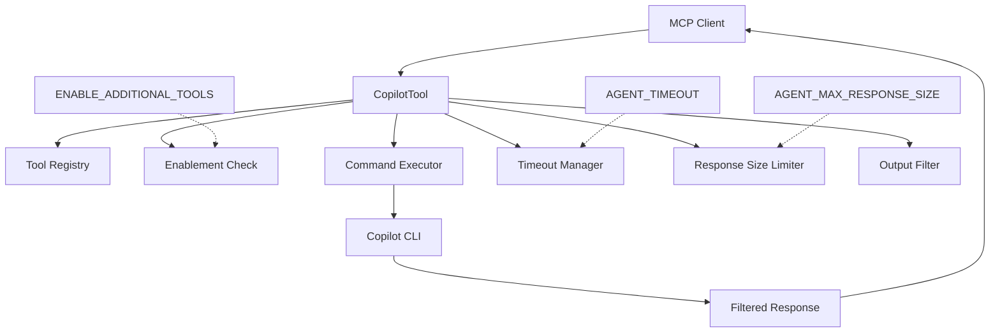
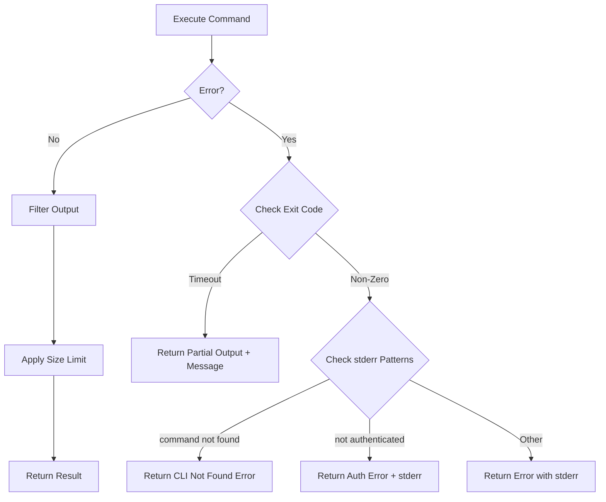

# GitHub Copilot Agent Tool - Design Document

## Overview

The GitHub Copilot Agent Tool integrates GitHub Copilot CLI as an MCP (Model Context Protocol) tool, enabling AI coding assistants to leverage Copilot's capabilities through its non-interactive command-line interface. This design follows the established patterns from existing agent tools (Q Developer, Gemini, Codex, Claude) while accommodating Copilot-specific features.

### Purpose
- Provide programmatic access to GitHub Copilot CLI for AI-to-AI interactions
- Enable code assistance, analysis, and generation through Copilot's models
- Support session management for contextual conversations
- Allow flexible permission and directory access control

### Key Design Principles
1. **Consistency**: Follow existing agent tool patterns for seamless integration
2. **Simplicity**: Minimal interface focused on agent execution
3. **Security**: Disabled by default, explicit enablement required
4. **Flexibility**: Pass-through parameter approach for future CLI compatibility

## Architecture

### Component Diagram



### Package Structure

```
internal/tools/copilotagent/
├── copilot.go           # Main implementation
└── types.go             # Type definitions (if needed)

tests/tools/
└── copilot_agent_test.go # Unit tests

docs/tools/
└── copilot-agent.md      # User documentation
```

### Integration Points

1. **Tool Registry**: Registers via `init()` function using `registry.Register(&CopilotTool{})`
2. **MCP Interface**: Implements `tools.Tool` interface with `Definition()` and `Execute()` methods
3. **Extended Help**: Implements `tools.ExtendedHelpProvider` interface with `ProvideExtendedInfo()` method
4. **Environment Variables**: Integrates with shared `AGENT_TIMEOUT` and `AGENT_MAX_RESPONSE_SIZE`

## Components and Interfaces

### CopilotTool Struct

```go
package copilotagent

type CopilotTool struct{}

// Constants matching other agents
const (
    DefaultTimeout             = 180             // 3 minutes
    DefaultMaxResponseSize     = 2 * 1024 * 1024 // 2MB
    AgentMaxResponseSizeEnvVar = "AGENT_MAX_RESPONSE_SIZE"
    AgentTimeoutEnvVar         = "AGENT_TIMEOUT"
)
```

### Core Methods

#### Definition Method
Returns MCP tool definition with:
- Tool name: "copilot-agent"
- Required parameter: `prompt` (string)
- Optional parameters:
  - `override-model` (string) - Maps to `--model`
  - `resume` (boolean) - Maps to `--continue`
  - `session-id` (string) - Maps to `--resume sessionId`
  - `yolo-mode` (boolean) - Maps to `--allow-all-tools`
  - `allow-tool` (array) - Maps to `--allow-tool` flags
  - `deny-tool` (array) - Maps to `--deny-tool` flags
  - `include-directories` (array) - Maps to `--add-dir` flags
  - `disable-mcp-server` (array) - Maps to `--disable-mcp-server` flags
- MCP Hint Annotations:
  - read-only: false
  - destructive: true
  - idempotent: false
  - open-world: true

#### Execute Method
Core execution flow:
1. Check tool enablement via `tools.IsToolEnabled("copilot-agent")`
2. Validate required prompt parameter
3. Parse optional parameters from args map
4. Build command with arguments
5. Execute with timeout
6. Handle errors (CLI not found, authentication, timeout)
7. Filter output
8. Apply size limits
9. Return result

#### Helper Methods

```go
// GetTimeout returns the configured timeout or default
func (t *CopilotTool) GetTimeout() int {
    if timeoutStr := os.Getenv(AgentTimeoutEnvVar); timeoutStr != "" {
        if timeout, err := strconv.Atoi(timeoutStr); err == nil && timeout > 0 {
            return timeout
        }
    }
    return DefaultTimeout
}

// GetMaxResponseSize returns the configured maximum response size
func (t *CopilotTool) GetMaxResponseSize() int {
    if sizeStr := os.Getenv(AgentMaxResponseSizeEnvVar); sizeStr != "" {
        if size, err := strconv.Atoi(sizeStr); err == nil && size > 0 {
            return size
        }
    }
    return DefaultMaxResponseSize
}

// ApplyResponseSizeLimit truncates the response if it exceeds the configured limit
func (t *CopilotTool) ApplyResponseSizeLimit(output string, logger *logrus.Logger) string
// Implementation matches Q Developer agent pattern

// runCopilot executes the Copilot CLI with the specified parameters
func (t *CopilotTool) runCopilot(ctx context.Context, logger *logrus.Logger, timeout time.Duration, prompt string, args map[string]any) (string, error)

// filterOutput removes Copilot-specific metadata from output
func (t *CopilotTool) filterOutput(output string) string
```

### Command Building Logic

The command building is done inline within the `runCopilot` method, following the pattern from other agents:

```go
func (t *CopilotTool) runCopilot(ctx context.Context, logger *logrus.Logger, timeout time.Duration, prompt string, args map[string]any) (string, error) {
    ctx, cancel := context.WithTimeout(ctx, timeout)
    defer cancel()

    // Build command arguments inline (matching Q Developer pattern)
    cmdArgs := []string{"-p", prompt, "--no-color"}

    // Model selection
    if model, ok := args["override-model"].(string); ok && model != "" {
        cmdArgs = append(cmdArgs, "--model", model)
    }

    // Session management - session-id takes priority
    if sessionID, ok := args["session-id"].(string); ok && sessionID != "" {
        cmdArgs = append(cmdArgs, "--resume", sessionID)
    } else if resume, ok := args["resume"].(bool); ok && resume {
        cmdArgs = append(cmdArgs, "--continue")
    }

    // Permission management
    if yoloMode, ok := args["yolo-mode"].(bool); ok && yoloMode {
        cmdArgs = append(cmdArgs, "--allow-all-tools")
    }

    // Array parameters - MCP provides as []any
    if allowTools, ok := args["allow-tool"].([]any); ok {
        for _, tool := range allowTools {
            if t, ok := tool.(string); ok {
                cmdArgs = append(cmdArgs, "--allow-tool", t)
            }
        }
    }

    // Similar pattern for deny-tool
    if denyTools, ok := args["deny-tool"].([]any); ok {
        for _, tool := range denyTools {
            if t, ok := tool.(string); ok {
                cmdArgs = append(cmdArgs, "--deny-tool", t)
            }
        }
    }

    // Include directories (no validation per requirements)
    if includeDirs, ok := args["include-directories"].([]any); ok {
        for _, dir := range includeDirs {
            if d, ok := dir.(string); ok {
                cmdArgs = append(cmdArgs, "--add-dir", d)
            }
        }
    }

    // Disable MCP servers
    if servers, ok := args["disable-mcp-server"].([]any); ok {
        for _, server := range servers {
            if s, ok := server.(string); ok {
                cmdArgs = append(cmdArgs, "--disable-mcp-server", s)
            }
        }
    }

    logger.Debugf("Running Copilot with args: %v", cmdArgs)

    cmd := exec.CommandContext(ctx, "copilot", cmdArgs...)

    var stdout, stderr bytes.Buffer
    cmd.Stdout = &stdout
    cmd.Stderr = &stderr

    err := cmd.Run()

    // Handle output and errors...
}
```

## Data Models

### Parameter Types

| Parameter | Type | Required | Maps To | Validation |
|-----------|------|----------|---------|------------|
| prompt | string | Yes | `-p/--prompt` | Non-empty |
| override-model | string | No | `--model` | None (pass-through) |
| resume | boolean | No | `--continue` | None |
| session-id | string | No | `--resume` | None |
| yolo-mode | boolean | No | `--allow-all-tools` | None |
| allow-tool | []string | No | `--allow-tool` (multiple) | None (pass-through) |
| deny-tool | []string | No | `--deny-tool` (multiple) | None (pass-through) |
| include-directories | []string | No | `--add-dir` (multiple) | None |
| disable-mcp-server | []string | No | `--disable-mcp-server` (multiple) | None |

### Response Format

The tool returns an MCP `CallToolResult` with:
- Success: Text output from Copilot (filtered)
- Error: Descriptive error message with stderr when available
- Timeout: Partial output with timeout message appended

## Error Handling

### Error Detection Patterns

| Error Type | Detection Pattern | Error Message | Priority |
|------------|------------------|---------------|----------|
| Tool Disabled | IsToolEnabled returns false | "copilot agent tool is not enabled. Set ENABLE_ADDITIONAL_TOOLS environment variable to include 'copilot-agent'" | Check first |
| Invalid Prompt | Empty or whitespace-only | "prompt is a required parameter and cannot be empty" | Parameter validation |
| Timeout | context.DeadlineExceeded | Return partial output with timeout message | During execution |
| CLI Not Found | Exit code != 0 AND ("command not found" or "executable file not found" in stderr) | "copilot CLI not found. Please install Copilot CLI and ensure it's available in your PATH" | After execution |
| Authentication | Exit code != 0 AND ("not authenticated" or "authentication" in stderr) | "copilot authentication failed. Please ensure you are authenticated. Error: {stderr}" | After execution |
| Other Error | Exit code != 0 with stderr | Return error with stderr output | Fallback |

### Error Handling Flow



## Output Filtering

### Filtering Strategy

The tool filters output to remove:
1. Progress indicators (lines starting with ● ✓ ✗ ↪)
2. Command execution traces (lines containing $ commands)
3. Usage statistics section (from "Total usage est" onwards)
4. File/directory operation descriptions
5. Other Copilot-specific metadata

### Implementation

```go
func (t *CopilotTool) filterOutput(output string) string {
    lines := strings.Split(output, "\n")
    var filtered []string

    for _, line := range lines {
        trimmedLine := strings.TrimSpace(line)

        // Detect start of usage statistics section - stop processing
        if strings.HasPrefix(trimmedLine, "Total usage est") {
            break
        }

        // Skip progress indicators and command traces
        if len(trimmedLine) > 0 {
            firstChar := trimmedLine[0]
            // Skip lines starting with: ● ✓ ✗ ↪
            if firstChar == '●' || firstChar == '✓' || firstChar == '✗' || firstChar == '↪' {
                continue
            }
        }

        // Skip command execution lines ($ command)
        if strings.HasPrefix(trimmedLine, "$") {
            continue
        }

        // Keep the actual content
        filtered = append(filtered, line)
    }

    // Clean up result
    result := strings.TrimSpace(strings.Join(filtered, "\n"))

    // Collapse multiple consecutive empty lines to single
    for strings.Contains(result, "\n\n\n") {
        result = strings.ReplaceAll(result, "\n\n\n", "\n\n")
    }

    return result
}
```

## Testing Strategy

### Unit Test Coverage

1. **Parameter Validation Tests**
   - Required prompt parameter validation
   - Empty/whitespace prompt rejection
   - Optional parameter parsing

2. **Command Construction Tests**
   - Correct flag mapping for all parameters
   - Array parameter handling
   - Priority of session-id over resume

3. **Error Handling Tests**
   - CLI not found detection
   - Authentication failure detection
   - Timeout handling with partial output

4. **Output Processing Tests**
   - Response size limiting
   - Output filtering for usage stats
   - Truncation at line boundaries

### Test Implementation Details

```go
func TestCopilotTool_Execute(t *testing.T) {
    tool := &CopilotTool{}
    logger := logrus.New()
    cache := &sync.Map{}
    ctx := context.Background()

    // Required parameter validation
    t.Run("MissingPrompt", func(t *testing.T) {
        args := map[string]any{}
        _, err := tool.Execute(ctx, logger, cache, args)
        assert.Error(t, err)
        assert.Contains(t, err.Error(), "required parameter")
    })

    t.Run("EmptyPrompt", func(t *testing.T) {
        args := map[string]any{"prompt": "  "}
        _, err := tool.Execute(ctx, logger, cache, args)
        assert.Error(t, err)
        assert.Contains(t, err.Error(), "cannot be empty")
    })

    // Timeout handling
    t.Run("TimeoutBehavior", func(t *testing.T) {
        os.Setenv("AGENT_TIMEOUT", "1")
        defer os.Unsetenv("AGENT_TIMEOUT")

        timeout := tool.GetTimeout()
        assert.Equal(t, 1, timeout)
    })

    // Response size limiting
    t.Run("ResponseSizeLimit", func(t *testing.T) {
        largeOutput := strings.Repeat("x", 3*1024*1024)
        limited := tool.ApplyResponseSizeLimit(largeOutput, logger)
        assert.Less(t, len(limited), len(largeOutput))
        assert.Contains(t, limited, "RESPONSE TRUNCATED")
    })

    // Output filtering
    t.Run("FilterCopilotOutput", func(t *testing.T) {
        input := `● Starting analysis
✓ Read file.go
$ grep pattern file
↪ 2 lines...

Actual content here
More actual content

Total usage est:       1 Premium request
Total duration (API):  1m 38.3s
Usage by model:
    claude-sonnet-4.5    222.8k input`

        filtered := tool.filterOutput(input)
        assert.NotContains(t, filtered, "●")
        assert.NotContains(t, filtered, "✓")
        assert.NotContains(t, filtered, "$ grep")
        assert.NotContains(t, filtered, "↪")
        assert.NotContains(t, filtered, "Total usage est")
        assert.NotContains(t, filtered, "Total duration")
        assert.Contains(t, filtered, "Actual content here")
        assert.Contains(t, filtered, "More actual content")
    })
}
```

### Command Construction Test Matrix

| Test Case | Parameters | Expected Flags |
|-----------|------------|----------------|
| Basic | prompt only | `-p "prompt" --no-color` |
| With Model | prompt, override-model | `-p "prompt" --no-color --model "model"` |
| Resume Latest | prompt, resume=true | `-p "prompt" --no-color --continue` |
| Resume Specific | prompt, session-id="abc" | `-p "prompt" --no-color --resume abc` |
| Both Resume | prompt, resume=true, session-id="abc" | `-p "prompt" --no-color --resume abc` (session-id wins) |
| Yolo Mode | prompt, yolo-mode=true | `-p "prompt" --no-color --allow-all-tools` |
| Multiple Arrays | prompt, allow-tool=["a","b"], deny-tool=["c"] | `-p "prompt" --no-color --allow-tool a --allow-tool b --deny-tool c` |

### Test File Location
- `tests/tools/copilot_agent_test.go` (matching existing pattern)

## Documentation Requirements

The tool requires documentation in the following locations:

1. **Tool Documentation**: `docs/tools/copilot-agent.md` - Detailed user documentation
2. **README.md**: Add to agent tools table (around line 141)
3. **docs/tools/overview.md**: Add to agents section and ENABLE_ADDITIONAL_TOOLS list
4. **internal/imports/tools.go**: Add import for `internal/tools/copilotagent` package
5. **internal/tools/enablement.go**: Already supports via existing pattern (no changes needed)

## Security Considerations

1. **Default Disabled**: Tool requires explicit enablement via `ENABLE_ADDITIONAL_TOOLS`
2. **Parameter Pass-through**: Parameters passed directly to CLI without validation
   - **Rationale**: Maintains flexibility for future CLI updates and permission patterns
   - **Risk Acceptance**: User is responsible for parameter content
3. **Directory Access**: `include-directories` allows access outside project boundaries
   - **Rationale**: Feature explicitly designed to enable cross-project access
   - **Risk**: Path traversal to sensitive directories is possible and intentional
4. **Yolo Mode**: Maps to `--allow-all-tools` which grants Copilot permission to execute tools
   - **Note**: File system permissions are still enforced by the OS, but Copilot can execute shell commands
   - **Risk**: With yolo-mode, Copilot could potentially execute destructive commands
5. **No Rate Limiting**: Acceptable risk per requirements decision
6. **No Authentication Management**: Users handle authentication externally via `gh auth login`

## Performance Considerations

1. **Timeout Management**: Default 3 minutes, configurable via environment
2. **Response Size**: Default 2MB limit, configurable via environment
   - **Edge Case**: Single lines exceeding 2MB are truncated mid-line
   - **Mitigation**: Attempt to find line boundary within last 100 chars
3. **Process Management**:
   - Single CLI process per execution
   - Process killed on timeout via context cancellation
   - No process group management (matching other agents)
4. **No Caching**: Each execution is independent
5. **Output Filtering**: Single pass through output, O(n) complexity

## Future Considerations

1. **Model Updates**: No validation allows automatic support for new models
2. **CLI Flag Changes**: Pass-through approach accommodates new flags
3. **Session Storage**: Current design relies on Copilot's internal session management
4. **Error Pattern Updates**: May need adjustment as CLI error messages evolve
5. **Output Format Changes**: Filter patterns may need updates if Copilot changes output format
   - Progress indicators (●, ✓, ✗, ↪) may change
   - Usage statistics format may evolve
   - Command trace format ($ commands) may vary

## Implementation Notes

1. **Package Naming**: Use `copilotagent` to match other agents (not `copilot-agent`)
2. **Constants**: Share timeout/size constants with other agents
3. **Logging**: Use provided logger with appropriate levels (Info, Debug, Warn, Error)
4. **Context Handling**: Respect context cancellation throughout execution
5. **Error Wrapping**: Use `fmt.Errorf` with `%w` for error chain preservation
6. **Output Characteristics**: Based on observed Copilot output:
   - Progress indicators use Unicode characters (●, ✓, ✗, ↪)
   - Commands are shown with $ prefix
   - File operations show line counts with "↪ N lines..."
   - Usage statistics appear at the end after actual content
   - Total duration shown in both API and wall clock time